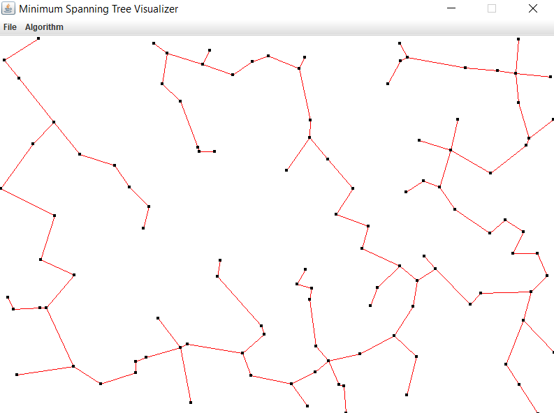

# Minimum Spanning Tree Visualizer
This was a project I did in high school after we learned about Prim's and Kruskal's algorithms for creating minimum spanning trees. The visualizer is simple, you can click to add nodes or create a random graph of 100 nodes. Then you can use either Prim's or Kruskal's and visualize the algorithm running. 
